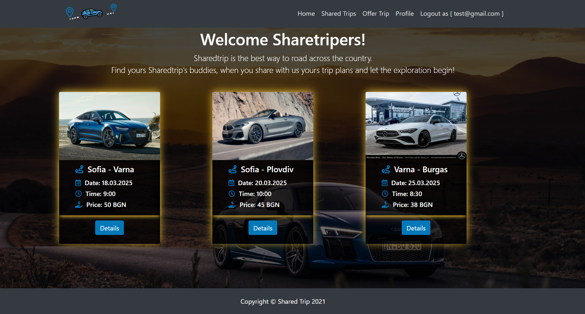

# Shared Trips 🚗🌍

Welcome to **Shared Trips**, an Express.js application where users can register, log in, and create exciting trips that others can join and enjoy!

## Features ✨

- 📝 **User Registration & Login**
  - Register with a unique username and password
  - Secure authentication system

- 📌 **Trip Management**
  - Create new trips with details (destination, date, description)
  - View all available trips
  - Join trips created by other users

## Tech Stack 🛠️

- **Backend:** Node.js, Express.js
- **Database:** MongoDB (Mongoose ODM)
- **Authentication:** bcrypt, express-session (or JWT, depending on implementation)
- **Templating Engine:**  Handlebars
- **Environment Variables:** dotenv

## Installation & Setup 🚀

1. **Clone the repository:**

```bash
git clone https://github.com/your-username/shared-trips.git
cd shared-trips
```

## Screenshot

